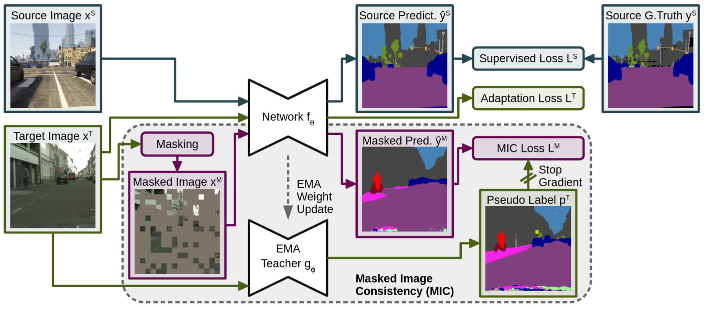
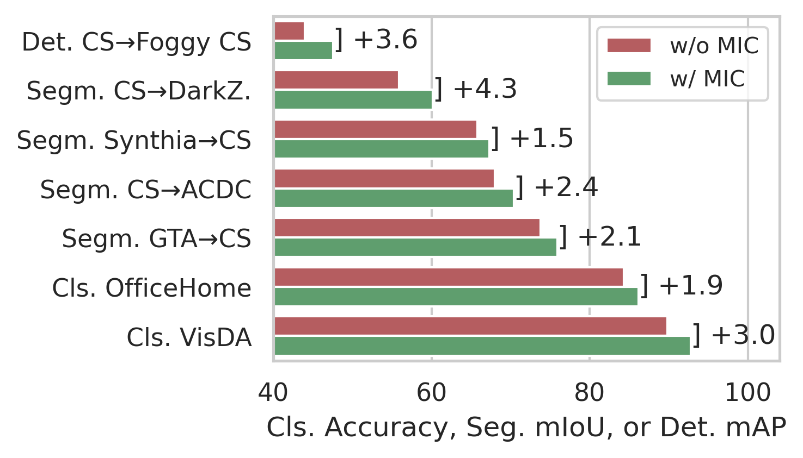
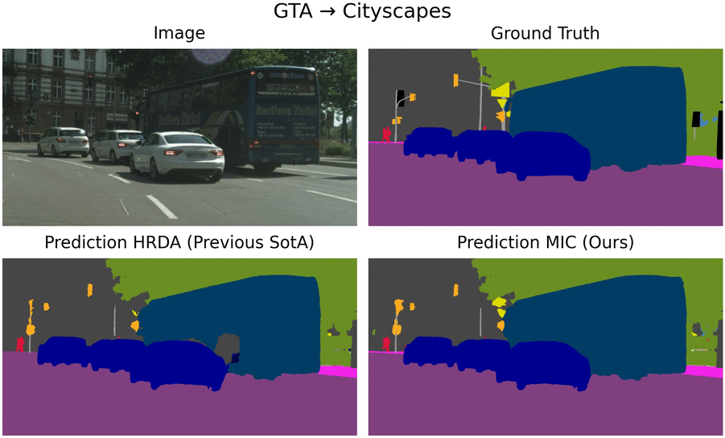

# MIC: Masked Image Consistency for Context-Enhanced Domain Adaptation

**by
[Lukas Hoyer](https://lhoyer.github.io/),
[Dengxin Dai](https://vas.mpi-inf.mpg.de/dengxin/),
[Haoran Wang](https://krumo.github.io/), and
[Luc Van Gool](https://scholar.google.de/citations?user=TwMib_QAAAAJ&hl=en)**

**[[Arxiv]](https://arxiv.org/abs/2212.01322)**
**[[Paper]](https://arxiv.org/pdf/2212.01322)**

:bell: We are happy to announce that MIC was accepted at **CVPR23**. :bell:

## Overview

 In unsupervised domain adaptation (UDA), a model trained on source data (e.g. synthetic)
 is adapted to target data (e.g. real-world) without access to target annotation.
 Most previous UDA methods struggle with classes that have a similar visual appearance
 on the target domain as no ground truth is available to learn the slight appearance
 differences. To address this problem, we propose a Masked Image Consistency (MIC) module
 to enhance UDA by learning spatial context relations of the target domain as additional
 clues for robust visual recognition.

 MIC enforces the consistency between predictions of masked target images, where random
 patches are withheld, and pseudo-labels that are generated based on the complete image by
 an exponential moving average teacher. To minimize the consistency loss, the network has
 to learn to infer the predictions of the masked regions from their context.



 Due to its simple and universal concept, MIC can be integrated into various UDA methods
 across different visual recognition tasks such as image classification, semantic
 segmentation, and object detection. MIC significantly improves the state-of-the-art
 performance across the different recognition tasks for synthetic-to-real,
 day-to-nighttime, and clear-to-adverse-weather UDA. For instance, MIC achieves an
 unprecedented UDA performance of 75.9 mIoU and 92.8% on GTA→Cityscapes and
 VisDA-2017, respectively, which corresponds to an improvement of +2.1 and +3.0
 percent points over the previous state of the art.




The improved domain adaptation performance is also reflected in the example
predictions on GTA→Cityscapes, Cityscapes→ACDC, and Cityscapes→Foggy Cityscapes
as shown below.




For more information on MIC, please check our
[[Paper]](https://arxiv.org/pdf/2212.01322).

If you find MIC useful in your research, please consider citing:

```
@InProceedings{hoyer2023mic,
  title={{MIC}: Masked Image Consistency for Context-Enhanced Domain Adaptation},
  author={Hoyer, Lukas and Dai, Dengxin and Wang, Haoran and Van Gool, Luc},
  booktitle={Proceedings of the IEEE/CVF Conference on Computer Vision and Pattern Recognition (CVPR)},
  year={2023}
}
```

## MIC for Domain-Adaptive Semantic Segmentation

You can find the source code to run MIC on domain-adaptive semantic segmentation
in the subfolder [seg/](seg/). For instructions how to set up the environment/datasets and how
to train MIC for semantic segmentation UDA, please refer to [seg/README.md](seg/README.md).

We recommend starting with MIC for semantic segmentation as it implements the full set
of configurations as well as the ablation studies.

## MIC for Domain-Adaptive Image Classification

You can find the source code to run MIC on domain-adaptive image classification
in the subfolder [cls/](cls/). For instructions how to set up the environment/datasets and how
to train MIC for image classification UDA, please refer to [cls/README.md](cls/README.md).

## MIC for Domain-Adaptive Object Detection

You can find the source code to run MIC on domain-adaptive object detection
in the subfolder [det/](det/). For instructions how to set up the environment/datasets and how
to train MIC for object detection UDA, please refer to [det/README.md](det/README.md).
